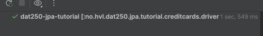
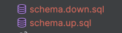
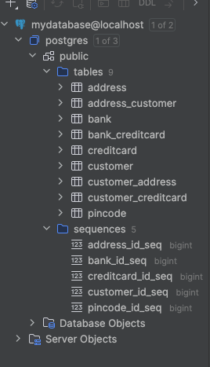

### Task 1 - Using a Dockerized application: PostgreSQL
I followed the instructions given, i wasn´t sure how much of the process I was meant to document and how but here are some images of the postgress database and the tables.
First part of code: https://github.com/KaroGil/dat250-jpa-tutorial/tree/ex7

Here you can see the test passed:

Here are the generated up and down files for the database:

And here are the tables that were produced by said files, as well as the postgres database setup.

###  Task 2 - Building you own dockerized application
Second part of the code ( with exercise 2/3 ): https://github.com/KaroGil/DAT250-ex2-3/tree/ex7/docker

Dockerfile: https://github.com/KaroGil/DAT250-ex2-3/blob/ex7/docker/Dockerfile
